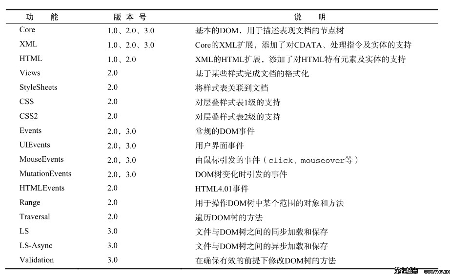

# javascript之DOM
DOM：（文档对象模型）描绘了一个层次化的节点树。
## 1.节点层次
HTML DOM 将 HTML 文档视作树结构。这种结构被称为节点树：

### 1.1.Node类型

**NodeTypes - Named Constants**
![NodeTypes - Named Constants]
(./image/dom/NodeTypes - Named Constants.png)
可以通过比较这些常量，确定节点类型:
```
if(someNode.nodeType == Node.ELEMENT_NODE){
	alert("Node is an element")
}//在ie中无效
if(someNode.nodeType == 1){
	alert("Node is an element")
}//在所有浏览器中有效
```
#### 1.1.1.Node属性
+ nodeName和nodeValue保存了节点的具体类型.使用这两个值之前最后先检测一下节点类型(如下).++对于元素节点:nodeName是元素的标签名,nodeValue始终为null.++
```
if(someNode.nodeType == 1){
	value = someNode.nodeName;
}//在所有浏览器中有效
```

+ 节点关系
每个节点都有一个childNodes属性,保存这一个NodeList对象(类数组对象)。
```
//访问NodeList中的节点
var firstChild = someNode.childNodes[0];//通过[]访问
var secondChild = someNode.childNodes.item(1);//通过item()方法访问
```
将NodeList对象转化为数组：
```
//在ie8及之前版本无效
var arrayOfNodes = Array.prototype.slice.call(someNodes.childNodes,0);
//兼容ie
function convertToArray(nodes){
	vararray = null;
    try{
    	array= Array.prototype.slice.call(nodes,0);
    }catch(ex){
    	for (var i=0;i<nodes.length;i++;){
        array.push(nodes[i]);
        }
	}
```
**注解:nodeType：显示节点的类型**
> nodeName：显示节点的名称
> nodeValue：显示节点的值
> attributes：获取一个属性节点
> firstChild：表示某一节点的第一个节点
> lastChild：表示某一节点的最后一个子节点
> childNodes：表示所在节点的所有子节点
> parentNode：表示所在节点的父节点
> nextSibling：紧挨着当前节点的下一个节点
> previousSibling：紧挨着当前节点的上一个节点

+ 操作节点
1.appendChild():向childNodes列表末尾添加一个节点,如果节点已经存在,则移动到末尾;
2.insertBefore():接受要插入节点与参照节点.
3.replaceChild():接受参数:插入节点和被替代节点
4.removeChild():移除节点
5.cloneNode():接受一个布尔值,表示是否执行深复制
6.normalize():处理文本节点

### 1.2.Document类型(文档)
在浏览器中,document对象是HTMLDocument(继承自Document类型)的一个实例,表示整个HTML页面.document对象也是window对象的属性,可以当做全局对象访问.
Document节点:
> nodeType:9
> nodeName:#document
> nodeValue:null
> parentNode:null
> owenerDocument:null
> 子节点可能是DocumentType(最多一个)、Element（最多一个）、ProcessingInstruction或Comment。

#### 1.2.1.文档子节点
其子节点可能是DocumentType(最多一个)、Element（最多一个）、ProcessingInstruction或Comment。但还有两个内置访问其子节点的快捷方式。
+ documentElement：始终指向<html>元素
+ 通过childNodes访问
+ 注解：document.body指向<body>元素
> document.doctype可以访问<!DOCTYPE>,但浏览器之间差别很大,所以用处不大

####1.2.2.文档信息
作为HTMLDocument的实例document,具有一些标准Document对象没有的属性:
document.title、document.URL、document.domain（域名）、document.referrer（来源页面域名）。
####1.2.3.查找元素
+ getElementById()//ie8及低版本不区分id大小写
+ getElementsByTagName()//返回一个动态的HTMLCollection对象(类似NodeList).
> HTMLCollection对象有一个namedItem()方法,可以通过元素的name取得集合

+ 只有HTMLDocument类型才有的方法getElementsByName():返回给定name特性的所有元素

#### 1.2.4.特殊集合
document对象还有一些特殊的集合,为HTMLCollection对象为访问文档常用部分提供的快捷方式
+ document.anchors:包含所有带name特性的`<a>`元素
+ document.applets:包含所有`<applet>`元素//不建议使用
+ document.forms:返回文档中所有`<form>`元素
+ document.imags:返回文档中所有的``元素
+ document.link:返回文档中所有带href特性的元素

#### 1.2.5.DOM一致性检测
由于DOM分为多个级别，也包含多个部分，因此检测浏览器实现了DOM的哪些部分就十分必要。document.implementation属性就是这些提供相应信息和功能的对象。与浏览器对DOM的实现直接对应。
DOM1级只为document.implementation规定了一个方法，即hasFeature()。这个方法接受两个参数:要检测的DOM功能的名称及版本号。如果浏览器支持给定名称和版本的功能，则该方法返回true。
```
var hasXmlDom = document.implementation.hsaFeature("XML","1.0");

```


#### 1.2.6文档写入
+ 将输出流写入网页:write(),writeln(),open(),close(),writeln()会在末尾添加一个字符串。
> 实例:
```
<!DOCTYPE html>
<html>
<head>
    <title>document.write() Example</title>
</head>
<body>
    <p>No extra characters here:</p>
    <script type="text/javascript">
        document.write("<script type=\"text\javascript\" src=\"file.js\">" + "<\/script>");
    </script>
	<center>
</center>
</body>
</html>
```
```
<!DOCTYPE html>
<html>
<head>
    <title>document.write() Example 4</title>
</head>
<body>
    <p>This is some content that you won't get to see because it will be overwritten.</p>
    <script type="text/javascript">
        window.onload = function(){
            document.write("Hello world!");
        };
    </script>
	<center>
</center>
</body>
</html>
//如果页面加载完后调用write(),输出内容会重绘整个页面
```

### 1.3.Element类型
Element对象表示XML文档中的元素。元素可包含属性、其他元素或文本。如果元素含有文本，则在文本节点中表示该文本。
重要事项：*文本永远存储在文本节点中。在 DOM 处理过程中的一个常见的错误是，导航到元素节点，并认为此节点含有文本。不过，即使最简单的元素节点之下也拥有文本节点。举例，在 <year>2005</year> 中，有一个元素节点（year），同时此节点之下存在一个文本节点，其中含有文本（2005）。*
由于元素对象也是一种节点，因此它可继承 Node 对象的属性和方法。
> nodeType:1
> nodeName:元素的标签名
> nodeValue:null
> parentNode:Document或Element
> 子节点可能是Element、Text、ProcessingInstruction、CDATASection或EntityRefrence。

要访问元素的标签名可以使用nodeName或tagName属性，比较标签名最好转换为大小写相同的形式
`if (element.tagname.toLowerCase() == "div"){}`

#### 1.3.1.HTML元素
所有HTML元素都由HTMLElement类型表示,不是直接通过该类型,而是通过他的子类。HTMLElement类型直接继承自Element并添加一些属性（对应于HTML元素中存在的特性：id、title、lang、dir、className）

#### 1.3.2.取得特性
+ getAttribute()
+ setAttribute()
+ removeAttribute()

#### 1.3.3.设置特性
+ setAttribute():参数:(特性名和值);特性会被统一转换为小写。

#### 1.3.4.attributes属性
Element类型是使用attributes属性的唯一一个DOM节点类型.attributes属性中包含一个NamedNodeMap,与NodeList类似。
NamedNodeMap对象拥有一下方法：
+ getNamedItem(name):返回nodeName属性等于name的节点
+ removeNamedItem(name):移除nodeName属性等于name的节点
+ setNamedItem(node):向列表中添加节点,以节点的nodeName属性为索引
+ item(pos):返回处于数字pos位置处的节点
```
function outputAttributes(element){
            var pairs = new Array(),
                attrName,
                attrValue,
                i,
                len;
> nodeType:1
> nodeName:元素的标签名
> nodeValue:null
> parentNode:Document或Element
> 子节点可能是Element、Text、ProcessingInstruction、CDATASection或EntityRefrence。
            for (i=0, len=element.attributes.length; i < len; i++){
                attrName = element.attributes[i].nodeName;
                attrValue = element.attributes[i].nodeValue;
                pairs.push(attrName + "=\"" + attrValue + "\"");
            }
            return pairs.join(" ");
        }
        //不同浏览器返回是顺序不同;ie7及以前版本会返回HTML元素所有可能的特性。
```
```
//改进版
        function outputAttributes(element){
            var pairs = new Array(),
                attrName,
                attrValue,
                i,
                len;

            for (i=0, len=element.attributes.length; i < len; i++){
                attrName = element.attributes[i].nodeName;
                attrValue = element.attributes[i].nodeValue;
                if (element.attributes[i].specified){
                    pairs.push(attrName + "=\"" + attrValue + "\"");
                }
            }
            return pairs.join(" ");
        }
```

#### 1.3.5.创建元素
+ document.createElement():接受元素的标签名为参数

#### 1.3.6.元素的子节点
+ getElementByTagName()

### 1.4.Text类型(文本节点)
> nodeType:3
> nodeName:#text
> nodeValue:节点包含的文本
> parentNode:Element
> 没有子节点

可以通过nodeValue或data属性访问Text中包含的文本。可以通过下列方法访问节点中的文本:
+ appendData(text):讲text添加到节点末尾
+ deleteData(offset,count):从offset指定位置开始删除count个字符
+ insertData(offset,text):插入text
+ replaceData(offset,count,text):替换
+ splitText(offset):从指定位置分成两个文本节点
+ substringData(offset,count):提取字符串
+ nodeValue.length=data.length

#### 1.4.1.创建文本节点
+ document.createTextNode()

#### 1.4.2.规范化文本节点
+ normalize():合并相邻的文本节点

#### 1.4.3.分割文本节点
+ splitText():

### 1.5 Comment类型
注释在DOM中是通过Comment类型来表示的。
Comment类型继承自Text类型，拥有除splitText()外的所有字符串操作方法
> nodeType:8
> nodeName:#conmment
> nodeValue:注释内容
> parentNode:Element或Document
> 不支持子节点
> 与Text继承至相同的基类,拥有除了splitText()外的所有方法

### 1.6 CDATASection类型
CDATASection类型只针对基于XML的文档，表示的是CDATA区域。与Comment类似，CDATASection类型继承自Text类型，拥有除splitText()外的所有字符串操作方法。
> nodeType:4
> nodeName:#cdata-section
> nodeValue:CDATA区域中的内容
> parentNode:Element或Document
> 不支持子节点
> 与Text继承至相同的基类,拥有除了splitText()外的所有方法

### 1.7 DocumentType类型
DocumentType类型在web浏览器中并不常用，仅有firefox、safari、opera支持。DocumentType类型包含着与文档的doctype有关的所有信息。
> nodeType:10
> nodeName:doctype的名称
> nodeValue:null
> parentNode:Document
> 不支持子节点
> 在DOM1中，DocumentType不能动态创建，只通过解析文档代码的方式创建。把DocumentType对象保存在document.doctype.
> DOM1中描述了DocumentType对象的3个属性:name（文档对象的名称）、entities（文档类型描述的实体的NamedNodeMap对象）、notations（文档类型描述的符号的NamedNodeMap对象）。通常entities、notations都是空列表。

### 1.8 DocumentFragment类型
所有节点类型中，只有DocumentFragment在文档中没有对应的标记。DOM规定文档片段（DocumentFragment类型）是一种“轻量级”文档，可以包含和控制节点，但不会像完整的文档那样占用额外的资源。
> nodeType:11
> nodeName:#document-fragment
> nodeValue:null
> parentNode:null
> 子节点可能是Element、Text、Comment、ProcessingInstruction、CDATASection或EntityRefrence。
> 创建文档片段：document.createDocumentFragment()
注：不过它有一种特殊的行为，该行为使得它非常有用，即当请求把一个 DocumentFragment 节点插入文档树时，插入的不是 DocumentFragment 自身，而是它的所有子孙节点。这使得 DocumentFragment 成了有用的占位符，暂时存放那些一次插入文档的节点。它还有利于实现文档的剪切、复制和粘贴操作，尤其是与 Range 接口一起使用时更是如此。

### 1.9 Attr类型
元素的特性在DOM中以Attr类型来表示。
> nodeType:2
> nodeName:特性的名称
> nodeValue:特性的值
> parentNode:null
> xml中子节点可能是Text或EntityRefrence。
> HTML中不支持子节点
> 特性不被认为是DOM文档树的一部分，常用getAttribute()、setAttribute()和removeAttribute()
> Attr对象有3个属性：name、value、specified
> document.createAttribute()传入特性名称可以创建新的特性节点

操作节点方法
```
function assignAttribute(){
            var element = document.getElementById("myDiv");
            var attr = document.createAttribute("align");
            attr.value = "left";
            element.setAttributeNode(attr);
            alert(element.attributes["align"].value);       //"left"
            alert(element.getAttributeNode("align").value); //"left"
            alert(element.getAttribute("align"));           //"left"
        }
```

## 2 DOM操作急速
### 2.1 动态脚本
```
		function loadScriptString(code){
            var script = document.createElement("script");
            script.type = "text/javascript";
            try {
                script.appendChild(document.createTextNode(code));
            } catch (ex){
                script.text = code;
            }
            document.body.appendChild(script);
        }
        function addScript(){
            loadScriptString("function sayHi(){alert('hi');}");
            sayHi();
        }
```

### 2.2 动态样式
```
 		function loadStyleString(css){
            var style = document.createElement("style");
            style.type = "text/css";
            try{
                style.appendChild(document.createTextNode(css));
            } catch (ex){
                style.styleSheet.cssText = css;
            }
            var head = document.getElementsByTagName("head")[0];
            head.appendChild(style);
        }
        function addStyle(){
            loadStyleString("body{background-color:red}");
        }
```

### 2.3 操作表格
### 2.4 使用NodeList