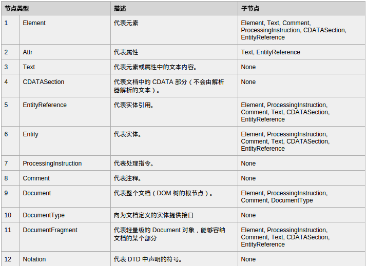

# javascript之DOM
DOM：（文档对象模型）描绘了一个层次化的节点树。
## 1.节点层次
HTML DOM 将 HTML 文档视作树结构。这种结构被称为节点树：

### 1.1.Node类型

**NodeTypes - Named Constants**
![NodeTypes - Named Constants]
(./image/dom/NodeTypes - Named Constants.png)
可以通过比较这些常量，确定节点类型:
```
if(someNode.nodeType == Node.ELEMENT_NODE){
	alert("Node is an element")
}//在ie中无效
if(someNode.nodeType == 1){
	alert("Node is an element")
}//在所有浏览器中有效
```
#### 1.1.1.Node属性
+ nodeName和nodeValue保存了节点的具体类型.使用这两个值之前最后先检测一下节点类型(如下).++对于元素节点:nodeName是元素的标签名,nodeValue始终为null.++
```
if(someNode.nodeType == 1){
	value = someNode.nodeName;
}//在所有浏览器中有效
```

+ 节点关系
每个节点都有一个childNodes属性,保存这一个NodeList对象(类数组对象)。
```
//访问NodeList中的节点
var firstChild = someNode.childNodes[0];//通过[]访问
var secondChild = someNode.childNodes.item(1);//通过item()方法访问
```
将NodeList对象转化为数组：
```
//在ie8及之前版本无效
var arrayOfNodes = Array.prototype.slice.call(someNodes.childNodes,0);
//兼容ie
function convertToArray(nodes){
	vararray = null;
    try{
    	array= Array.prototype.slice.call(nodes,0);
    }catch(ex){
    	for (var i=0;i<nodes.length;i++;){
        array.push(nodes[i]);
        }
	}
```
**注解:nodeType：显示节点的类型**
> nodeName：显示节点的名称
> nodeValue：显示节点的值
> attributes：获取一个属性节点
> firstChild：表示某一节点的第一个节点
> lastChild：表示某一节点的最后一个子节点
> childNodes：表示所在节点的所有子节点
> parentNode：表示所在节点的父节点
> nextSibling：紧挨着当前节点的下一个节点
> previousSibling：紧挨着当前节点的上一个节点

+ 操作节点
1.appendChild():向childNodes列表末尾添加一个节点,如果节点已经存在,则移动到末尾;
2.insertBefore():接受要插入节点与参照节点.
3.replaceChild():接受参数:插入节点和被替代节点
4.removeChild():移除节点
5.cloneNode():接受一个布尔值,表示是否执行深复制
6.normalize():处理文本节点

### 1.2.Document类型(文档)
在浏览器中,document对象是HTMLDocument(继承自Document类型)的一个实例,表示整个HTML页面.document对象也是window对象的属性,可以当做全局对象访问.
Document节点:
> nodeType:9
> nodeName:#document
> nodeValue:null
> parentNode:null
> owenerDocument:null
> 子节点可能是DocumentType(最多一个)、Element（最多一个）、ProcessingInstruction或Comment。

#### 1.2.1.文档子节点
其子节点可能是DocumentType(最多一个)、Element（最多一个）、ProcessingInstruction或Comment。但还有两个内置访问其子节点的快捷方式。
+ documentElement：始终指向<html>元素
+ 通过childNodes访问
+ 注解：document.body指向<body>元素
> document.doctype可以访问<!DOCTYPE>,但浏览器之间差别很大,所以用处不大

####1.2.2.文档信息
作为HTMLDocument的实例document,具有一些标准Document对象没有的属性:
document.title、document.URL、document.domain（域名）、document.referrer（来源页面域名）。
####1.2.3.查找元素
+ getElementById()//ie8及低版本不区分id大小写
+ getElementsByTagName()//返回一个动态的HTMLCollection对象(类似NodeList).
> HTMLCollection对象有一个namedItem()方法,可以通过元素的name取得集合

+ 只有HTMLDocument类型才有的方法getElementsByName():返回给定name特性的所有元素

#### 1.2.4.特殊集合
document对象还有一些特殊的集合,为HTMLCollection对象为访问文档常用部分提供的快捷方式
+ document.anchors:包含所有带name特性的`<a>`元素
+ document.applets:包含所有<applet>元素//不建议使用
+ document.forms:返回文档中所有<form>元素
+ document.imags:返回文档中所有的元素
+ document.link:返回文档中所有带href特性的元素

#### 1.2.5.DOM一致性检测
